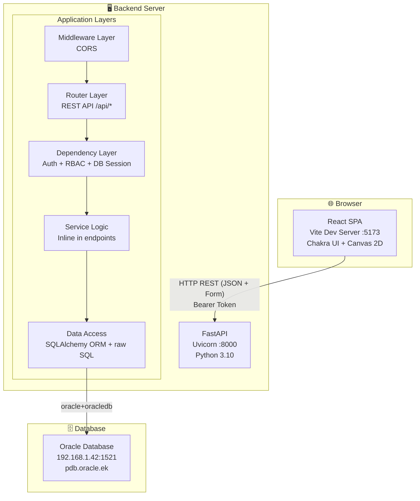
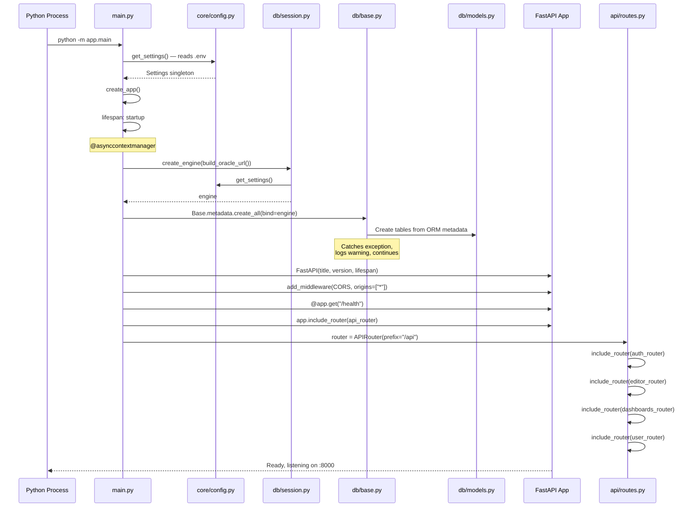
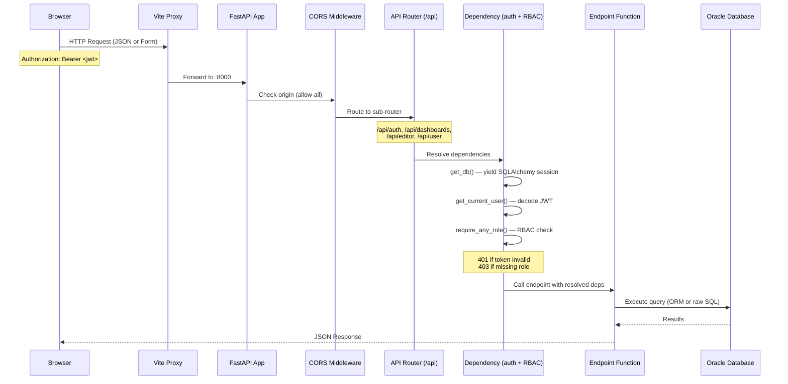
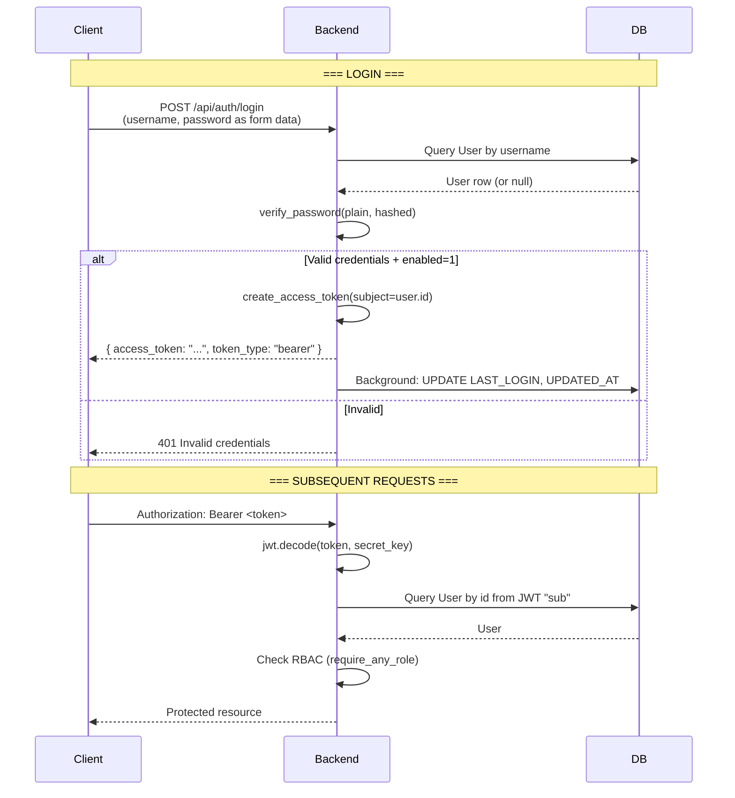
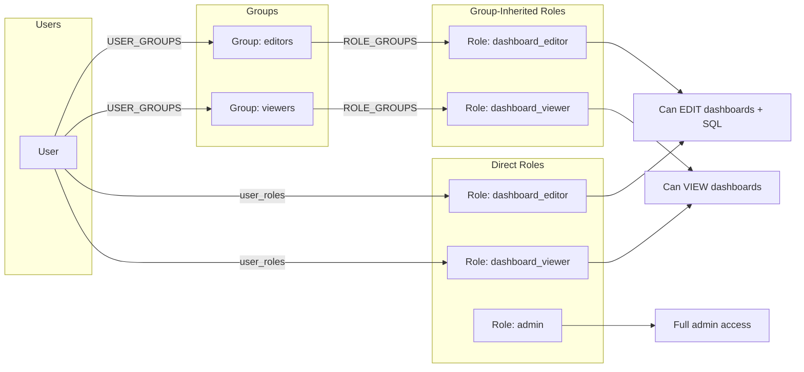
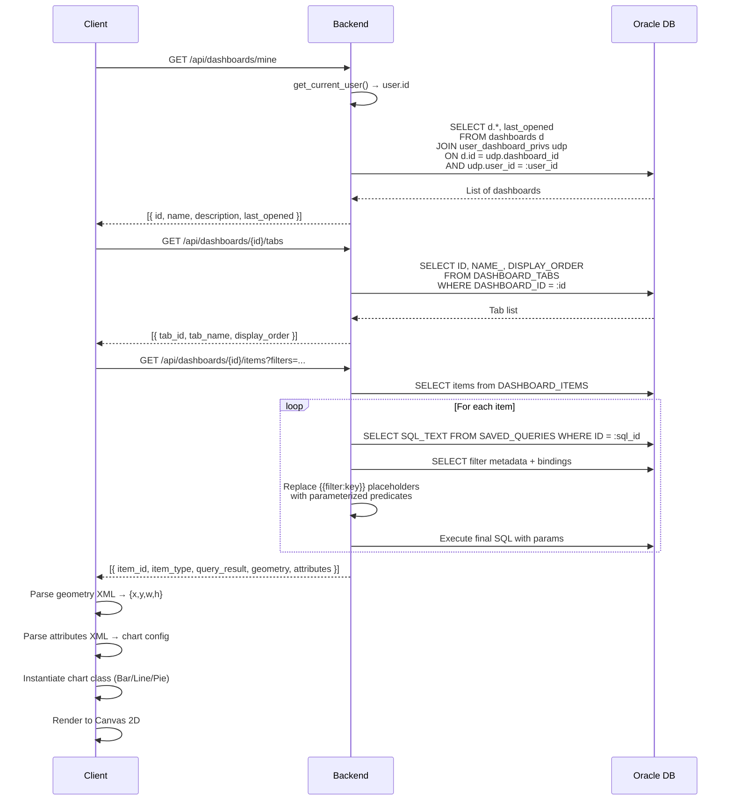

# System Architecture

> Generated: 2026-06-07 | Confidence: HIGH

## Overview

The Dashboard Viewer is a **two-tier web application** that provides an OBIEE-like dashboard viewing and editing experience. It consists of:

1. A **FastAPI backend** (Python 3.10) serving a REST API and connecting to an Oracle database
2. A **React/TypeScript frontend** (Vite) providing a Persian/RTL user interface

The system allows users to:
- Authenticate via JWT-based login
- View dashboards composed of SQL-backed charts (Bar, Line, Pie)
- Edit SQL queries through an in-browser Monaco editor
- Apply runtime filters to dashboard data
- Navigate dashboard tabs

---

## High-Level Architecture



---

## Application Startup Sequence

### Backend Startup



### Frontend Startup

```mermaid
sequenceDiagram
    participant Browser
    participant Vite as Vite Dev Server :5173
    participant React as React App
    participant Router as React Router
    participant Axios as Axios

    Browser->>Vite: Request index.html
    Vite-->>Browser: SPA shell + main.tsx

    Browser->>React: ReactDOM.createRoot()
    React->>React: loadFonts() — inject @font-face CSS
    React->>Axios: Register 401 response interceptor
    React->>React: Render providers:
    Note over React: ChakraProvider > QueryClientProvider > RouterProvider

    React->>Router: Match current URL
    alt URL is /
        Router->>Browser: Render HomePage
    alt URL is /login
        Router->>Browser: Render LoginPage
    alt URL is /editor or /viewer/:id
        Router->>Browser: Render ProtectedRoute
        alt JWT in localStorage
            Router->>Browser: Render page
        else No JWT
            Router->>Browser: Navigate to /login
        end
    end
```

---

## Request Lifecycle



---

## Middleware Stack

| Order | Middleware | Purpose | Configuration |
|-------|-----------|---------|---------------|
| 1 | CORS | Cross-Origin Resource Sharing | `allow_origins=["*"]`, `allow_credentials=True`, all methods/headers |
| 2 | Router | URL path routing | `/api` prefix with sub-routers |

**Note:** No custom middleware for logging, rate limiting, or request ID generation. The middleware stack is minimal.

---

## Authentication Flow



---

## Authorization Model (RBAC)



A user's effective roles = **direct roles ∪ group-inherited roles**. The `require_any_role()` dependency simply checks if the intersection of [user's effective roles] and [required roles] is non-empty.

---

## Data Flow: Dashboard Viewing



---

## Key Architectural Properties

| Property | Implementation | Notes |
|----------|---------------|-------|
| API Style | REST + OAuth2 form-encoded auth | Login/register use form-encoded, not JSON |
| Auth | JWT (HS256, 120 min expiry) | Stored in localStorage on frontend |
| AuthZ | RBAC via roles + groups | Direct and inherited role resolution |
| ORM | SQLAlchemy 2.0 declarative | Used for auth queries; raw SQL for dashboard items |
| Migrations | Alembic (configured, unused) | DB tables created via `Base.metadata.create_all()` on startup |
| Caching | None | No Redis, no in-memory cache |
| Background Tasks | FastAPI BackgroundTasks | Used for login timestamp updates and SQL audit logging |
| Error Handling | Try/except with HTTPException | No global exception handlers; errors returned as 500 with raw message |
| Logging | print() statements | No structured logging configured |
| Static Files | None served by backend | Frontend served separately by Vite |

---

## Deployment Model

```
Production:
  Frontend: npm run build → static files served by nginx/CDN
  Backend:  gunicorn app.main:app (or uvicorn with workers)

Development:
  Frontend: npm run dev → Vite :5173 (HMR, proxy to backend)
  Backend:  uvicorn app.main:app --reload :8000
```

The Vite proxy config maps `/api` and `/auth` paths to the backend, avoiding CORS issues in development. In production, a reverse proxy (nginx) handles this mapping.
