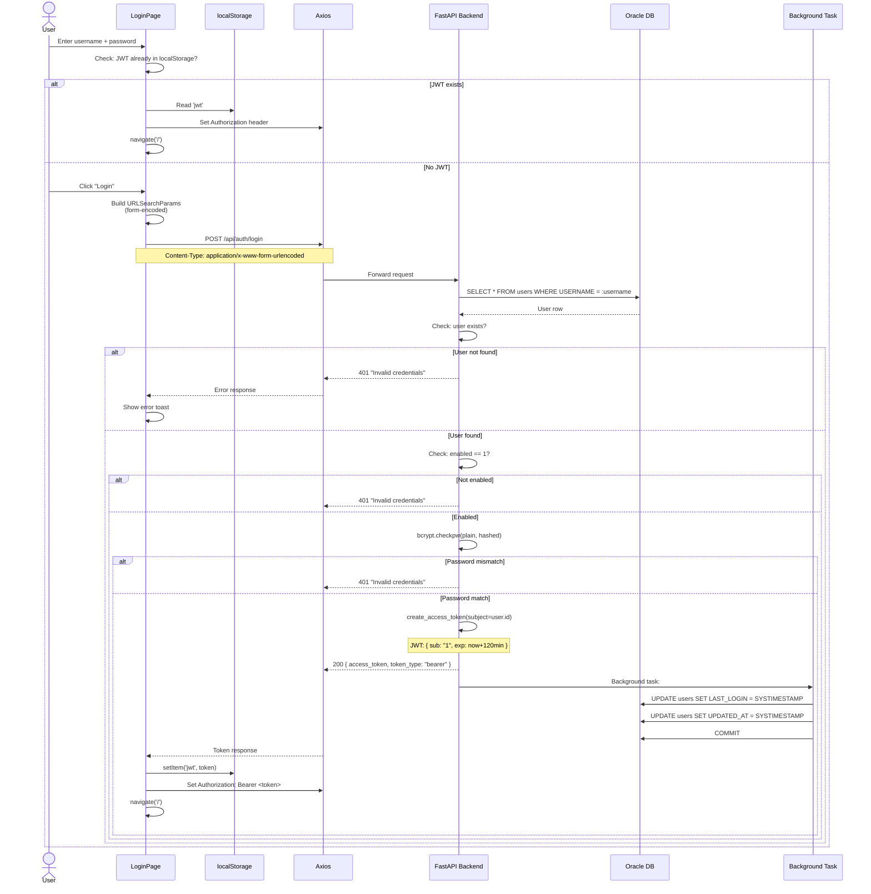
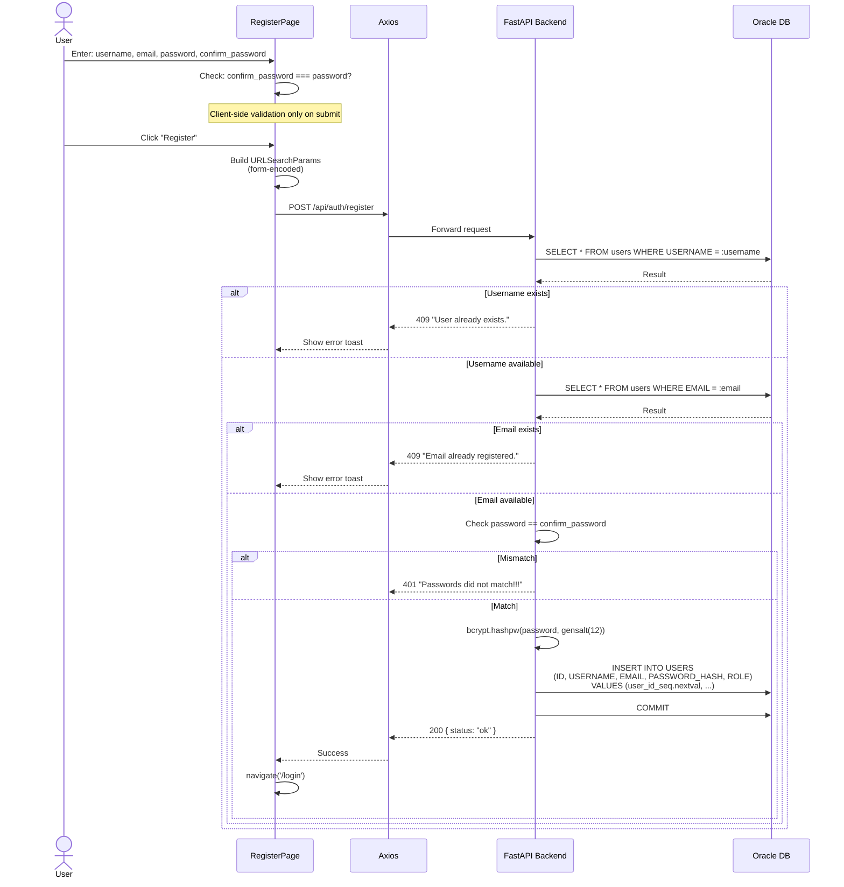
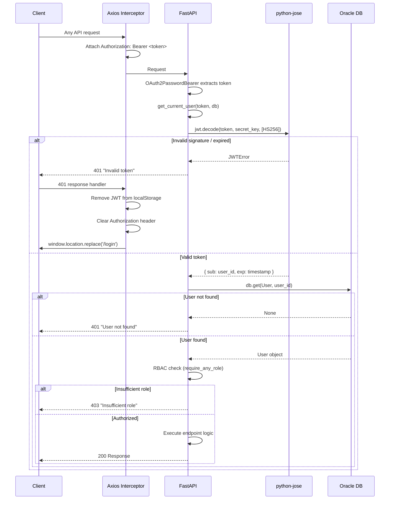

# Authentication Flow Diagrams

> Generated: 2026-06-07 | Confidence: HIGH

## Complete Login Flow



---

## Registration Flow



---

## Token Validation Flow (Per-Request)



---

## 401 Interceptor Flow (Frontend)

```mermaid
flowchart TD
    A[API Request] --> B[Axios sends request with Auth header]
    B --> C{Response status?}
    C -->|200| D[Process response normally]
    C -->|401| E[Axios response interceptor fires]
    C -->|Other error| F[Component catch block handles]

    E --> G[localStorage.removeItem('jwt')]
    G --> H[delete axios.defaults.headers.common Authorization]
    H --> I{Current path === '/login'?}
    I -->|Yes| J[Stay on /login<br/>Prevent redirect loop]
    I -->|No| K[window.location.replace('/login')]

    K --> L[Browser hard-reloads /login]
    L --> M[LoginPage mounts]
    M --> N{localStorage has JWT?}
    N -->|No| O[Show login form]
    N -->|Yes - leftover| P[navigate to /]
```

---

## Role Resolution Flow

```mermaid
flowchart TD
    A[get_user_role_names(user, db)] --> B[Initialize empty set]
    B --> C{user.roles exist?}
    C -->|Yes| D[For each role:<br/>normalize and add name]
    C -->|No| E{user.groups exist?}
    D --> E
    E -->|Yes| F[For each group:<br/>For each group.role:<br/>normalize and add name]
    E -->|No| G[Return role_names set]
    F --> G

    G --> H[require_any_role checks:<br/>user_roles ∩ required ≠ ∅?]
    H -->|Yes| I[Return user → endpoint executes]
    H -->|No| J[403: Insufficient role]
```
