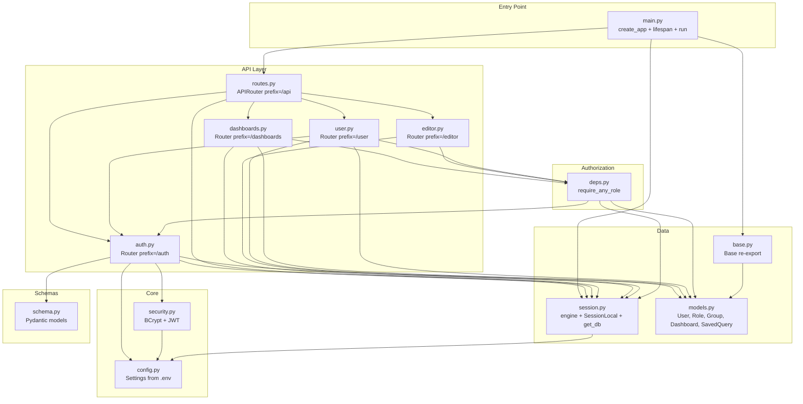

# Backend Architecture Diagrams

> Generated: 2026-06-07 | Confidence: HIGH

## Module Dependency Graph



---

## Request Processing Pipeline

```mermaid
flowchart TD
    REQ[HTTP Request] --> CORS{CORS Check}
    CORS -->|Allowed| PATH{Path Match}
    CORS -->|Blocked| ERR_CORS[Blocked]
    PATH -->|/health| HEALTH[healthcheck()]
    PATH -->|/api/*| API[api/routes.py]
    PATH -->|No match| ERR_404[404 Not Found]

    API -->|/api/ping| PING[ping() - DB check]
    API -->|/api/auth/*| AUTH_ROUTE[auth.py router]
    API -->|/api/dashboards/*| DASH_ROUTE[dashboards.py router]
    API -->|/api/editor/*| EDITOR_ROUTE[editor.py router]
    API -->|/api/user/*| USER_ROUTE[user.py router]

    AUTH_ROUTE -->|/login| LOGIN[login endpoint]
    AUTH_ROUTE -->|/register| REG[register endpoint]
    Note over AUTH_ROUTE: Public - no auth required

    DASH_ROUTE --> DEP_DASH[Dependencies resolved:<br/>get_db<br/>get_current_user<br/>require_any_role]
    EDITOR_ROUTE --> DEP_EDITOR[Dependencies resolved:<br/>get_db<br/>get_current_user<br/>require_any_role]
    USER_ROUTE --> DEP_USER[Dependencies resolved:<br/>get_db<br/>get_current_user]

    DEP_DASH --> DASH_HANDLER[Endpoint handler executes]
    DEP_EDITOR --> EDITOR_HANDLER[Endpoint handler executes]
    DEP_USER --> USER_HANDLER[Endpoint handler executes]

    DASH_HANDLER --> RESP[HTTP Response]
    EDITOR_HANDLER --> RESP
    USER_HANDLER --> RESP
    HEALTH --> RESP
    PING --> RESP
    LOGIN --> RESP
    REG --> RESP
```

---

## Database Access Patterns

```mermaid
flowchart TD
    ENDPOINT[Endpoint Function] --> METHOD{Access Method?}

    METHOD -->|ORM Simple| ORM[db.query or db.get]
    ORM --> SESSION1[SQLAlchemy Session]
    SESSION1 --> ENGINE1[Engine]

    METHOD -->|ORM Create| ORM_CREATE[db.add + db.commit + db.refresh]
    ORM_CREATE --> SESSION2[SQLAlchemy Session]
    SESSION2 --> ENGINE2[Engine]

    METHOD -->|Raw SQL| RAW[text('SELECT/INSERT/UPDATE ...')]
    RAW --> CONN1[db.bind.connect()]
    CONN1 --> ENGINE3[Engine]
    Note over RAW: Used for unmapped tables<br/>and complex queries

    METHOD -->|Raw SQL<br/>Background| BG[BackgroundTasks.add_task]
    BG --> CONN2[db.bind.connect()]
    CONN2 --> ENGINE4[Engine]
    Note over BG: Used for audit logs<br/>and timestamp updates

    ENGINE1 --> POOL[Connection Pool<br/>pool_pre_ping=True]
    ENGINE2 --> POOL
    ENGINE3 --> POOL
    ENGINE4 --> POOL
    POOL --> ORACLE[(Oracle DB)]
```

---

## Authorization Check Flow

```mermaid
flowchart TD
    START[Endpoint called with<br/>user = Depends(require_any_role(...))] --> GCU[get_current_user called]
    GCU --> DECODE[Decode JWT token]
    DECODE -->|Valid| FETCH[Fetch User from DB]
    DECODE -->|Invalid| ERR401[401: Invalid token]
    FETCH -->|Found| RESOLVE[get_user_role_names(user, db)]
    FETCH -->|Not found| ERR401B[401: User not found]

    RESOLVE --> DIRECT{Direct roles?}
    DIRECT -->|Yes| ADD_DIRECT[Add normalized role names]
    DIRECT -->|No| GROUPS{Groups?}
    ADD_DIRECT --> GROUPS
    GROUPS -->|Yes| ITER[For each group:<br/>add group.roles names]
    GROUPS -->|No| CHECK{Intersection with<br/>required roles?}
    ITER --> CHECK

    CHECK -->|Non-empty| PASS[Return user → endpoint executes]
    CHECK -->|Empty| ERR403[403: Insufficient role]
```
