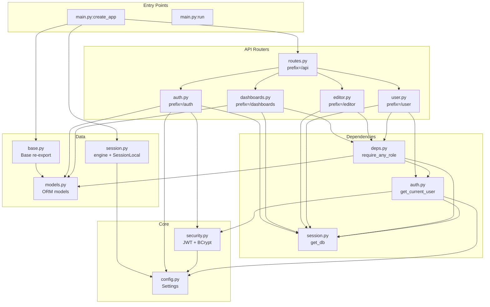

# Dependency & Call Graph

> Generated: 2026-06-07 | Confidence: HIGH

## Backend Call Graph



### Call Frequency & Hot Paths

| Endpoint | Method | Called By | DB Queries per Request |
|----------|--------|-----------|----------------------|
| `/api/auth/login` | POST | LoginPage | 1 (user lookup) + 2 background (LAST_LOGIN, UPDATED_AT) |
| `/api/auth/register` | POST | RegisterPage | 2 (duplicate checks) + 1 (INSERT) |
| `/api/dashboards/mine` | GET | HomePage | 1 (JOIN query) |
| `/api/dashboards/{id}/items` | GET | ViewerPage | 1 + N*2 (N items × SQL lookup + filter lookup) |
| `/api/dashboards/{id}/tabs` | GET | ViewerPage | 1 |
| `/api/dashboards/{id}/filter-groups` | GET | ViewerPage | 1 (complex JOIN) |
| `/api/editor/sql/execute` | POST | EditorPage | 1 (user SQL) |
| `/api/editor/sql/save` | POST | EditorPage | 1 (upsert) + 2 background (update log) |
| `/api/user/roles` | GET | HomePage | 0 (in-memory from ORM relationships) |

### N+1 Query Analysis

The `/api/dashboards/{id}/items` endpoint has a **potential N+1 pattern**: for each dashboard item, it fetches:
1. The SQL text from `SAVED_QUERIES`
2. The filter metadata from `DASHBOARD_FILTERS` + `DASHBOARD_FILTER_BINDINGS`

These are **sequential queries per item** — for a dashboard with 20 items, this means ~41 queries. This is acceptable for small dashboards but could be optimized with a single JOIN query.

---

## Frontend Component Hierarchy

```mermaid
graph TD
    ROOT[main.tsx<br/>App Root]
    CHAKRA[ChakraProvider]
    QUERY[QueryClientProvider]
    ROUTER[RouterProvider]

    ROOT --> CHAKRA --> QUERY --> ROUTER

    ROUTER --> HOME[HomePage<br/>route: /]
    ROUTER --> LOGIN[LoginPage<br/>route: /login]
    ROUTER --> REG[RegisterPage<br/>route: /register]
    ROUTER --> EDITOR[EditorPage<br/>route: /editor]
    ROUTER --> VIEWER[ViewerPage<br/>route: /viewer/:id]

    EDITOR --> PR1[ProtectedRoute]
    VIEWER --> PR2[ProtectedRoute]

    EDITOR --> MONACO[@monaco-editor/react]
    EDITOR --> TT1[ThemeToggle]
    LOGIN --> TT2[ThemeToggle]
    REG --> TT3[ThemeToggle]
    HOME --> TT_ICONS[Feather Icons]

    VIEWER --> BC[BarChartCanvas]
    VIEWER --> LC[LineChartCanvas]
    VIEWER --> PC[PieChartCanvas]

    BC --> BAR_CORE[BarChartItem]
    LC --> LINE_CORE[LineChartItem]
    PC --> PIE_CORE[PieChartItem]

    BAR_CORE --> DASH_ITEM[DashboardItem<br/>abstract base]
    LINE_CORE --> DASH_ITEM
    PIE_CORE --> DASH_ITEM

    BAR_CORE --> UTILS[utils.ts]
    LINE_CORE --> UTILS
    PIE_CORE --> UTILS
    HOME --> UTILS
```

---

## Page → Service → Endpoint Mapping

| Page | User Action | API Call | Backend Endpoint |
|------|------------|----------|-----------------|
| HomePage | Page load | GET | `/api/dashboards/mine` |
| HomePage | Page load | GET | `/api/user/roles` |
| HomePage | Create dashboard | (navigates to /create) | (not yet implemented) |
| HomePage | Click dashboard | (navigates to /viewer/:id) | — |
| LoginPage | Submit form | POST | `/api/auth/login` |
| RegisterPage | Submit form | POST | `/api/auth/register` |
| EditorPage | Page load | GET | `/api/editor/sql/saved` |
| EditorPage | Run SQL | POST | `/api/editor/sql/execute` |
| EditorPage | Save SQL | POST | `/api/editor/sql/save` |
| ViewerPage | Page load | GET | `/api/dashboards/{id}` |
| ViewerPage | Page load | GET | `/api/dashboards/{id}/tabs` |
| ViewerPage | Page load | GET | `/api/dashboards/{id}/items` |
| ViewerPage | Page load | GET | `/api/dashboards/{id}/filter-groups` |
| ViewerPage | Apply filter | GET | `/api/dashboards/{id}/items?filters=...` |
| ViewerPage | Switch tab | (client-side filter) | — |

---

## Hook → Service Dependencies

All data fetching in the frontend uses **direct axios calls** inside `useEffect` or `useCallback` hooks. No custom hooks or service abstractions exist.

| Hook | Page | Fetches |
|------|------|---------|
| `useEffect` (mount) | LoginPage | JWT from localStorage, redirect if valid |
| `useEffect` (mount) | HomePage | JWT setup, fetchDashboards, fetchUserRoles |
| `useEffect` (mount) | EditorPage | JWT setup, fetchSavedQueries |
| `useEffect` (mount) | ViewerPage | JWT setup, fetchDashboardItems, fetchDashboardTabs, fetchDashboardName, fetchFilterGroups |
| `useCallback` | ViewerPage | fetchDashboardItems (with optional filters) |
| `useCallback` | EditorPage | fetchSavedQueries |

---

## Shared Utilities & Cross-Cutting Concerns

### Backend

| Module | Type | Used By |
|--------|------|---------|
| `get_db()` | Generator dependency | All API modules |
| `get_current_user()` | Callable dependency | deps.py, user.py |
| `require_any_role()` | Dependency factory | dashboards.py, editor.py, user.py |
| `get_settings()` | LRU-cached singleton | security.py, session.py, auth.py |
| `verify_password()` | Function | auth.py |
| `create_access_token()` | Function | auth.py |

### Frontend

| Module | Type | Used By |
|--------|------|---------|
| `toPersianDigits()` | Function | BarChartItem, LineChartItem, PieChartItem, HomePage, ViewerPage |
| `formatWithThousandSeparators()` | Function | All chart items, utils |
| `lightenColor()` | Function | LineChartItem, PieChartItem |
| `addOpacity()` | Function | LineChartItem, PieChartItem |
| `parseGeometry()` | Function | ViewerPage |
| `parseBarAttributes()` | Function | ViewerPage |
| `parseLineAttributes()` | Function | ViewerPage |
| `parsePieAttributes()` | Function | ViewerPage |
| `DashboardItem` (abstract) | Class | BarChartItem, LineChartItem, PieChartItem |
| `ProtectedRoute` | Component | EditorPage, ViewerPage (via router) |
| `ThemeToggle` | Component | LoginPage, RegisterPage, EditorPage |
| Axios 401 interceptor | Global | All pages (via axios instance) |

---

## Architectural Bottlenecks

| Bottleneck | Location | Impact | Mitigation |
|-----------|----------|--------|------------|
| N+1 queries in items endpoint | `dashboards.py:get_dashboard_items` | Linear growth in DB round-trips per item | Batch with single JOIN |
| Single DB connection pool default | `db/session.py` | All requests share same pool | Configure pool size |
| No caching layer | System-wide | Every dashboard view hits DB for all data | Add Redis/in-memory cache |
| Sequential filter replacement | `dashboards.py:filter_replacer` | Blocking string processing per request | Precompile filter templates |
| Canvas 2D on main thread | ViewerPage chart components | May block UI for large datasets | Offload to Web Worker |
| No pagination on items | `dashboards.py:get_dashboard_items` | FETCH FIRST 1000 ROWS only — large datasets truncated silently | Add pagination params |
| `Base.metadata.create_all()` on every startup | `main.py:lifespan` | Unnecessary schema check on each restart | Conditionally run only in dev |
