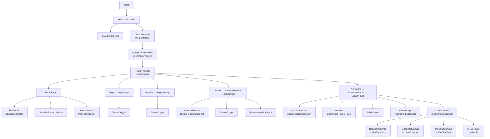
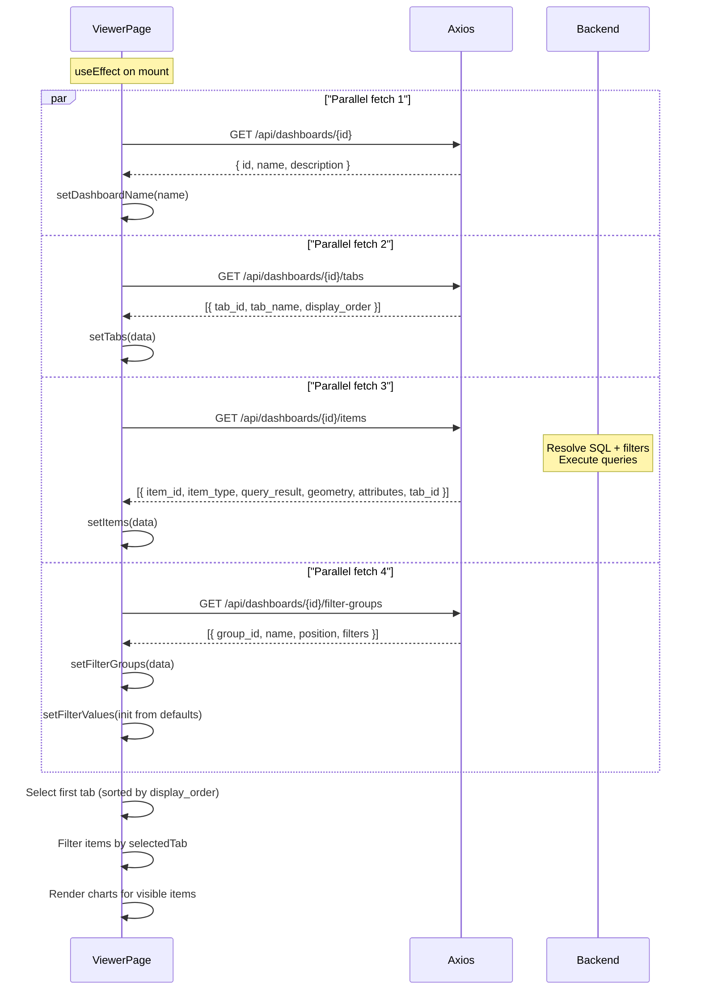
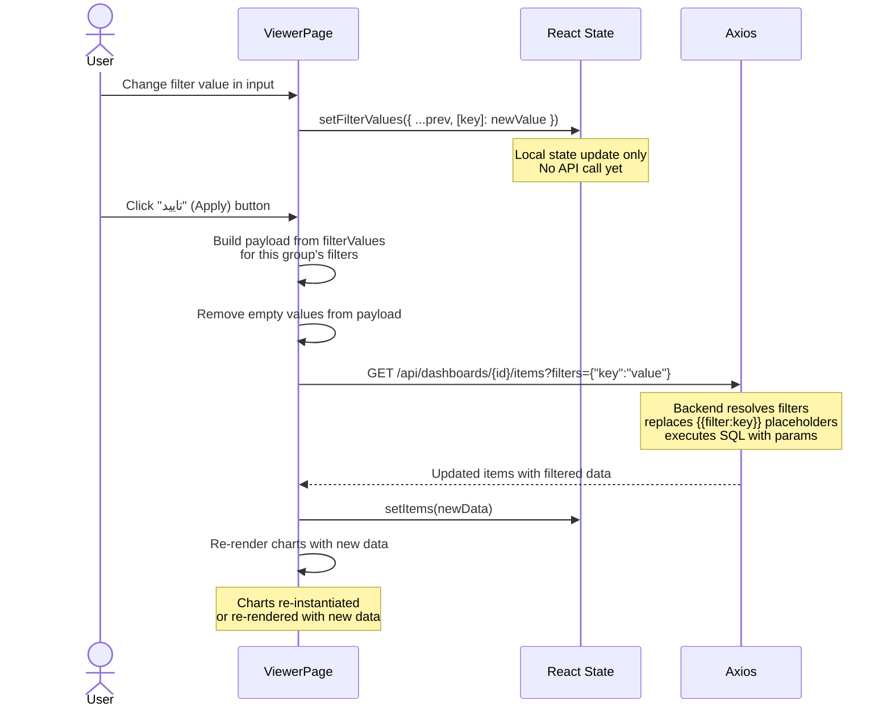

# Frontend Architecture Diagrams

> Generated: 2026-06-07 | Confidence: HIGH

## Component Tree



---

## Data Fetching Flow (ViewerPage)



---

## Chart Rendering Lifecycle

```mermaid
flowchart TD
    A[ViewerPage receives items] --> B{For each item<br/>in selected tab}
    B --> C{item_type?}
    C -->|BAR| D[parseGeometry + parseBarAttributes]
    C -->|LIN| E[parseGeometry + parseLineAttributes]
    C -->|PIE| F[parseGeometry + parsePieAttributes]
    C -->|default| G[Render Chakra Table]

    D --> H[toRowObjects: columns + rows → Record[]]
    E --> H
    F --> H

    H --> I[Create BarChartCanvas component]
    H --> J[Create LineChartCanvas component]
    H --> K[Create PieChartCanvas component]

    I --> L[initChart callback]
    L --> M["new BarChartItem(id, dashboardId, order, geom, attrs, data, ctx)"]
    M --> N["chart.render(null)"]
    N --> O["Canvas 2D draws bars, grid, labels, title, totals"]

    O --> P[User moves mouse]
    P --> Q["getSliceAtCursor(mouseX, mouseY)"]
    Q --> R{Hit?}
    R -->|Yes| S["setHoveredPoint({index, measureIndex})"]
    S --> T["chart.render(hoveredPoint)"]
    T --> U["Re-draw with highlighted segment<br/>Show tooltip"]
    R -->|No| V["clearHover → render(null)"]
```

---

## Filter Application Flow


