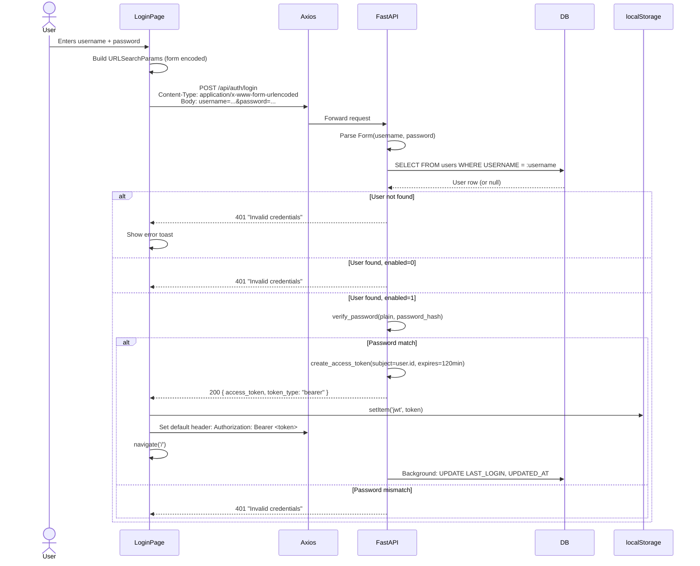
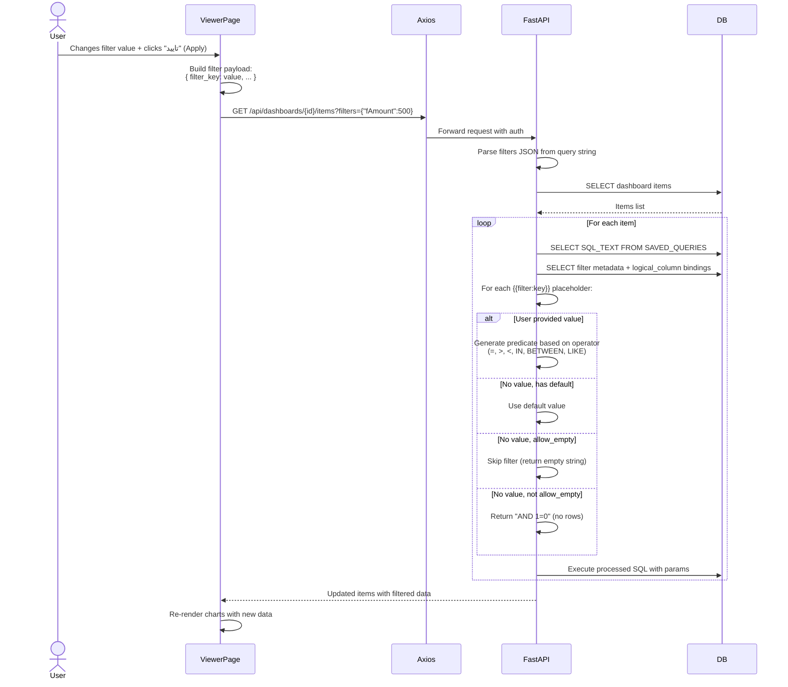
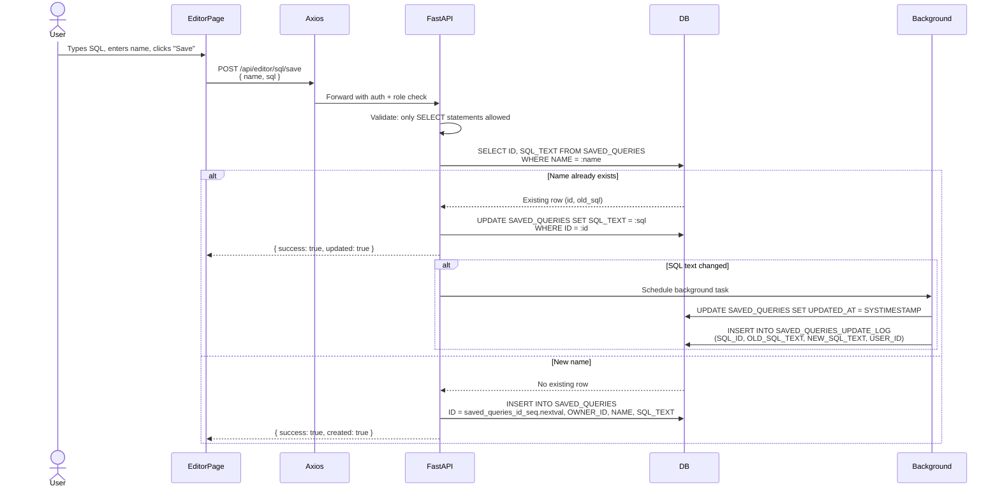

# Request Lifecycle

> Generated: 2026-06-07 | Confidence: HIGH

## Full Request Lifecycle: Dashboard Viewing

This documents the complete flow from a user clicking a dashboard to seeing rendered charts.

```mermaid
sequenceDiagram
    actor User
    participant Browser
    participant React as React App
    participant Router as React Router
    participant VP as ViewerPage
    participant Axios as Axios
    participant Vite as Vite Proxy
    participant FastAPI as FastAPI
    participant Auth as Auth Dependency
    participant RBAC as RBAC Check
    participant DB as Oracle DB
    participant Canvas as Canvas 2D

    User->>Browser: Clicks dashboard card on HomePage
    Browser->>React: Navigate to /viewer/123
    Router->>VP: Mount ViewerPage with id=123

    par Parallel API calls
        VP->>Axios: GET /api/dashboards/123
        Axios->>Vite: Proxy request
        Vite->>FastAPI: GET /api/dashboards/123
        FastAPI->>Auth: get_current_user(token)
        Auth->>Auth: jwt.decode(token)
        Auth->>DB: SELECT FROM users WHERE ID = :sub
        Auth-->>FastAPI: User object
        FastAPI->>RBAC: require_any_role("dashboard_viewer",...)
        RBAC-->>FastAPI: Authorized
        FastAPI->>DB: SELECT FROM dashboards WHERE id = 123
        DB-->>FastAPI: Dashboard row
        FastAPI-->>Vite-->>Axios-->>VP: { id, name, description }
    and
        VP->>Axios: GET /api/dashboards/123/tabs
        Note over VP,Axios: Same auth/RBAC flow
        DB-->>VP: [{ tab_id, tab_name, display_order }]
    and
        VP->>Axios: GET /api/dashboards/123/items
        Note over VP,Axios: Same auth/RBAC flow
        loop For each dashboard item
            FastAPI->>DB: SELECT SQL_TEXT FROM SAVED_QUERIES
            FastAPI->>DB: SELECT filter metadata + bindings
            FastAPI->>FastAPI: Replace {{filter:key}} placeholders
            FastAPI->>DB: Execute parameterized SQL
        end
        DB-->>VP: [{ item_id, item_type, query_result, geometry, attributes }]
    and
        VP->>Axios: GET /api/dashboards/123/filter-groups
        Note over VP,Axios: Same auth/RBAC flow
        DB-->>VP: [{ group_id, name, position, filters: [...] }]
    end

    VP->>VP: Set state: items, tabs, filterGroups, dashboardName
    VP->>VP: Select first tab (sorted by display_order)
    VP->>VP: Filter items by selectedTab

    loop For each visible item
        VP->>VP: parseGeometry(item.geometry) → {x,y,w,h}
        VP->>VP: parseAttributes(item.attributes) → ChartConfig
        VP->>VP: toRowObjects(query_result) → data[]
        VP->>Canvas: new BarChartItem / LineChartItem / PieChartItem
        Canvas->>Canvas: chart.render(null)
        Note over Canvas: clearRect, draw background,<br/>grid lines, data bars/lines/arcs,<br/>labels with Persian digits
    end

    Canvas-->>User: Dashboard rendered
```

---

## Authentication Request Lifecycle



---

## Filter Application Lifecycle



---

## SQL Save/Update Lifecycle



---

## Error Handling Flow

```mermaid
flowchart TD
    A[API Request] --> B{Token valid?}
    B -->|No| C[401: Invalid token]
    B -->|Yes| D{RBAC check passes?}
    D -->|No| E[403: Insufficient role]
    D -->|Yes| F[Execute endpoint logic]
    F --> G{Exception?}
    G -->|HTTPException| H[Return status + detail]
    G -->|Other Exception| I[500: str(e)]
    G -->|Success| J[Return 200/201 + response model]

    C --> K[Frontend: Axios 401 interceptor]
    K --> L[Clear localStorage jwt]
    L --> M[Delete Authorization header]
    M --> N{Navigating to /login?}
    N -->|No| O[window.location.replace('/login')]
    N -->|Yes| P[Stay on /login]
```

The frontend's global Axios 401 interceptor (`main.tsx:78-93`) catches all 401 responses and:
1. Removes the JWT from localStorage
2. Clears the Authorization header
3. Redirects to `/login` (unless already on the login page — prevents redirect loops)
