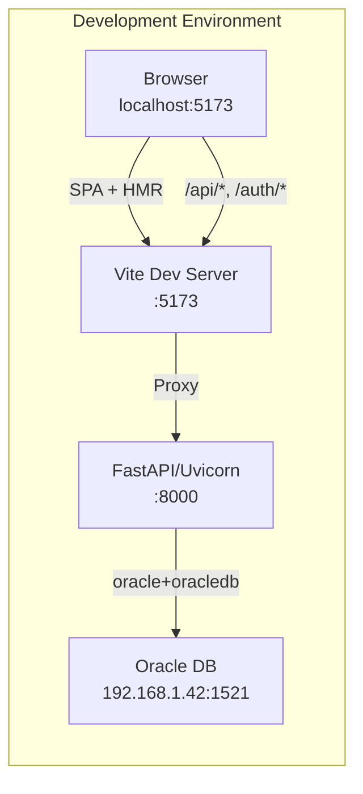
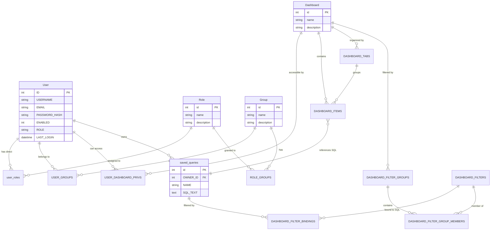
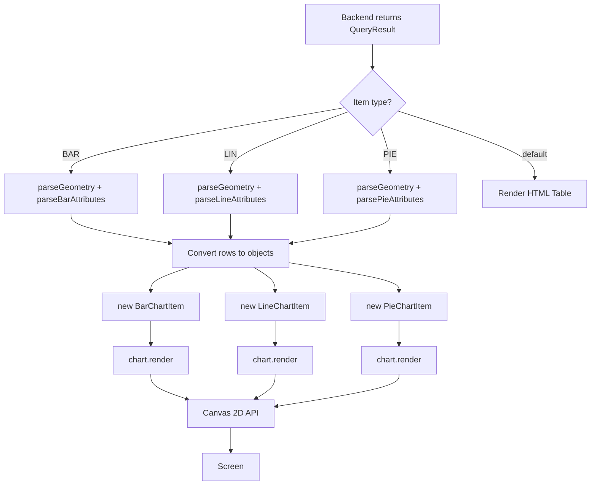

# System Overview Diagrams

> Generated: 2026-06-07 | Confidence: HIGH

## Component Architecture

```mermaid
graph TB
    subgraph "Frontend (Vite + React 18 + TypeScript)"
        direction TB

        subgraph "Pages"
            HP[HomePage<br/>Dashboard listing]
            LP[LoginPage<br/>OAuth2 login]
            RP[RegisterPage<br/>User registration]
            EP[EditorPage<br/>SQL editor]
            VP[ViewerPage<br/>Dashboard viewer]
        end

        subgraph "Components"
            PR[ProtectedRoute<br/>Auth guard]
            TT[ThemeToggle<br/>Dark/Light mode]
        end

        subgraph "Core"
            DI[DashboardItem<br/>Abstract chart base]
            BC[BarChartItem<br/>Canvas 2D bars]
            LC[LineChartItem<br/>Canvas 2D lines]
            PC[PieChartItem<br/>Canvas 2D donuts]
            UT[utils.ts<br/>Colors, Persian digits,<br/>XML parsers]
        end

        subgraph "Infrastructure"
            Router[React Router v6]
            Query[TanStack Query]
            Axios[Axios + interceptors]
            Chakra[Chakra UI]
        end
    end

    subgraph "Backend (FastAPI + Python 3.10)"
        direction TB

        subgraph "API Layer"
            AuthAPI[Auth Router<br/>login, register, token]
            DashAPI[Dashboards Router<br/>CRUD, items, tabs, filters]
            EditorAPI[Editor Router<br/>SQL execute, save, list]
            UserAPI[User Router<br/>roles lookup]
        end

        subgraph "Cross-Cutting"
            Deps[Authorization<br/>require_any_role]
            Security[JWT + BCrypt<br/>core/security.py]
            Config[Settings<br/>core/config.py]
        end

        subgraph "Data Layer"
            Session[Session Factory<br/>db/session.py]
            Models[ORM Models<br/>db/models.py]
            RawSQL[Raw SQL via text()]
        end
    end

    subgraph "Database"
        Oracle[(Oracle DB<br/>22 tables)]
    end

    HP --> Router
    LP --> Router
    RP --> Router
    EP --> PR
    VP --> PR
    VP --> BC
    VP --> LC
    VP --> PC
    BC --> DI
    LC --> DI
    PC --> DI
    BC --> UT
    LC --> UT
    PC --> UT

    EP --> Axios
    VP --> Axios
    HP --> Axios
    LP --> Axios

    Axios --> AuthAPI
    Axios --> DashAPI
    Axios --> EditorAPI
    Axios --> UserAPI

    AuthAPI --> Deps
    DashAPI --> Deps
    EditorAPI --> Deps
    UserAPI --> Deps

    Deps --> Security
    Security --> Config
    Deps --> Session
    Session --> Config

    AuthAPI --> Models
    DashAPI --> Models
    Deps --> Models

    AuthAPI --> RawSQL
    DashAPI --> RawSQL
    EditorAPI --> RawSQL
    Session --> Oracle
    RawSQL --> Oracle
    Models --> Oracle
```

---

## Network Architecture



---

## Data Model Overview



---

## Chart Rendering Pipeline



---

## Module Dependency Graph

```
backend/app/main.py
  └─ api/routes.py (prefix="/api")
       ├─ api/auth.py       /api/auth/*
       │    ├─ core/security.py
       │    ├─ core/config.py
       │    ├─ db/session.py
       │    ├─ db/models.py
       │    └─ schemas.py
       ├─ api/dashboards.py  /api/dashboards/*
       │    ├─ api/deps.py
       │    │    ├─ api/auth.py (get_current_user)
       │    │    ├─ db/models.py
       │    │    └─ db/session.py
       │    ├─ db/session.py
       │    └─ db/models.py
       ├─ api/editor.py      /api/editor/*
       │    ├─ api/deps.py
       │    └─ db/session.py
       └─ api/user.py        /api/user/*
            ├─ api/deps.py
            ├─ api/auth.py (get_current_user)
            ├─ db/session.py
            └─ db/models.py
```

## Architectural Decisions & Trade-offs

| Decision | Rationale | Trade-off |
|----------|-----------|-----------|
| Canvas 2D over ECharts | Full control over Persian digits, RTL layout | More code to maintain, no accessibility |
| Raw SQL for dashboard items | Flexibility for complex Oracle queries | No ORM type safety, SQL injection risk if filters mishandled |
| Form-encoded auth (not JSON) | OAuth2 password flow compatibility | Non-standard for modern SPAs |
| `Base.metadata.create_all()` on startup | Quick dev setup | Not safe for production (use Alembic) |
| No service layer | Simplicity for smaller codebase | Business logic mixed with HTTP concerns |
| JWT in localStorage | Simple implementation | Vulnerable to XSS (httpOnly cookie would be more secure) |
| CORS allow all origins | Easy development setup | Production security concern |
